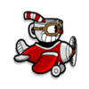
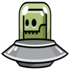

#  (Plane Fight) 

UTN - Facultad Regional Buenos Aires - Materia Paradigmas de Programación

## Equipo de desarrollo: 

- Ezequiel Reichel
- Camila Nicole Ramos Fariña
- Catalina Wierna
- Gabriel Juarez
- Gonzalo Leon Bolaña
 
## Capturas 
"Cuphead" - Enemigo cuerpo a cuerpo - Enemigo a distancia:

      

Diagrama estatico
.png)

## Reglas de Juego / Instrucciones

El juego "Plane Fight" se basa en el combate aereo del *personaje principal* contra una serie de enemigos que pueden hacerte daño de distinta manera (por ejemplo, enemigos con misiles y otros que ataquen cuerpo a cuerpo). El personaje principal posee vida (3 corazones) y los enemigos tambien tendran su correspondiente cantidad de vida, ambos objetos entienden/conocen el mensaje de perderVida pero cada uno tiene su metodo correspondiente (se aplica polimorfismo). 

La dificultad del juego se incrementara a medida que se maten enemigos. Cada X cantidad de enemigos asesinados, la fase cambiara, cambiando el tipo de enemigos que aparecen y luego en fases posterios modificando tambien la velocidad tanto del movimiento de los enemigos cuerpo a cuerpo como asi tambien la velocidad e intervalo de disparo de los enemigos a distancia.

Al finalizar la partida (cuando el personaje principal muere) se calcula un score en base a los enemigos matados (cada enemigo tiene un puntaje distinto).

ENEMIGOS: 
- Cuerpo a Cuerpo: Genera daño cuando hay una colicion.
- Disparo a distancia: Se mantiene en el borde derecho y dispara proyectiles rectos.

El objetivo del personaje es la superviviencia en contra de los enemigos que vayan aparaciendo a lo largo del juego

## Controles:

- `aswd` y "flechitas" para que el personaje principal se mueva por la pantalla
- `space` para que el personaje principal dispare proyectiles
- `V` para visualizar la vida del personaje principal
