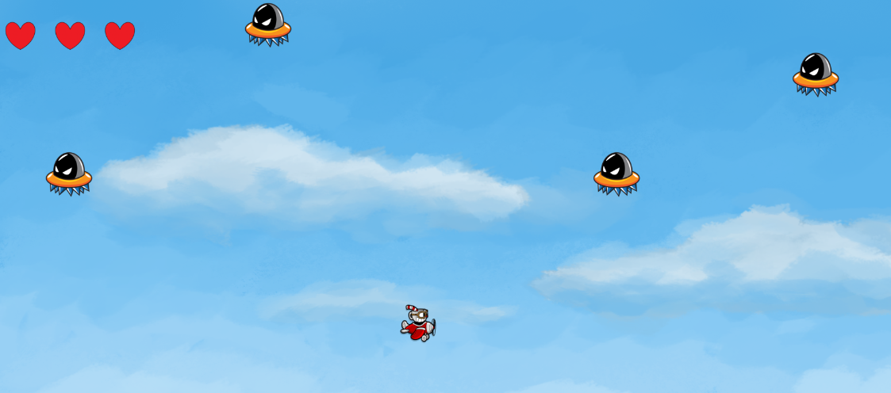
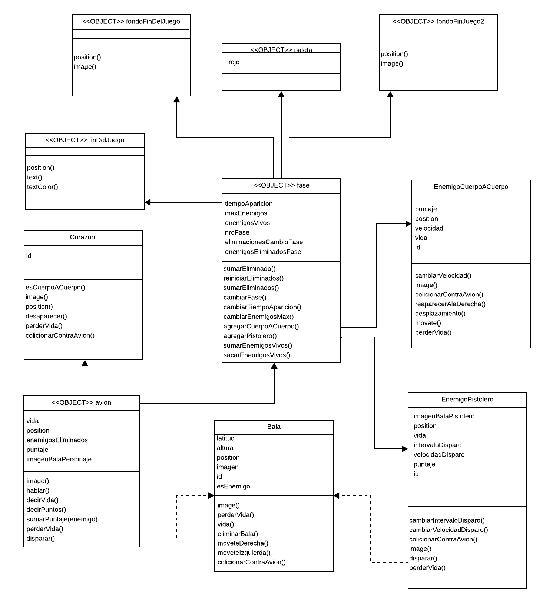

#  (Plane Fight) 

UTN - Facultad Regional Buenos Aires - Materia Paradigmas de Programación

## Equipo de desarrollo: 

- Ezequiel Reichel
- Camila Nicole Ramos Fariña
- Catalina Wierna
- Gabriel Juarez
- Gonzalo Leon Bolaña
 
## Capturas 
"Cuphead" - Enemigo cuerpo a cuerpo - Enemigo a distancia:

      

Capturas juego:

Diagrama estatico

## Reglas de Juego / Instrucciones

El juego "Plane Fight" se basa en el combate aereo del *personaje principal* (nuestro amigo "Cuphead" en su avioneta) contra una serie de enemigos que pueden hacerle daño de distinta manera (enemigos con misiles que atacan a distancia y otros enemigos que "van a por el" atacando cuerpo a cuerpo). Cuphead posee una cantidad de vida (3 corazones, representados en la esquina izquierda superior de la pantalla) y los enemigos tambien tendran su correspondiente cantidad de vida. Si, tanto los enemigos (sin importar que sea del tipo cuerpo a cuerpo o a distancia) como las balas enemigas, colisionan con el avion, este ultimo se vera perjudicado reduciendo su vida. *En la colision del avion con un elemento, se aplica polimorfismo con en dichos elementos, esperando que los mismos entiendan/conozcan el mensaje de colisionar contra el avion* 

¿Como se defiende Cuphead? 
Nuestro personaje puede atacar a estos rivales mediante el disparo de balas, estas, si impactan en los enemigos, haran que su vida se reduzca en una unidad. *Ambos enemigos entienden/conocen el mensaje de perderVida al colisionar con las balas de Cuphead, pero cada uno tiene su comportamiento correspondiente (se aplica polimorfismo).* 

La dificultad del juego se incrementara a medida que se maten enemigos. Cada X cantidad de enemigos asesinados, la fase cambiara, cambiando el tipo de enemigos que aparecen y luego en fases posterios modificando tambien la velocidad tanto del movimiento de los enemigos cuerpo a cuerpo, como asi tambien la velocidad e intervalo de disparo de los enemigos a distancia.

Al finalizar la partida (cuando el personaje principal muere, es decir, su vida es igual a cero) se calcula un score en base a los enemigos eliminados (cada tipo de enemigo otorga un puntaje distinto al ser ejecutado).

ENEMIGOS: 
- Cuerpo a Cuerpo: Genera daño cuando hay una colicion.
- Disparo a distancia: Se mantiene en el borde derecho y dispara proyectiles rectos (ojo, tampoco te acerques tanto que tambien genera daño si lo colisionas)

El objetivo del personaje es la superviviencia en contra de los enemigos que vayan aparaciendo a lo largo del juego

## Controles:

- `aswd` y "flechitas" para que el personaje principal se mueva por la pantalla
- `space` para que el personaje principal dispare proyectiles
  
